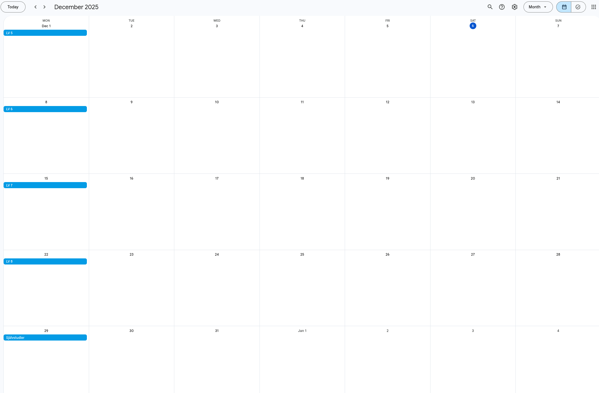

# Lasvecka

A web-application for displaying the current study week at Chalmers University of Technology.

## How it works

The application is a scraper and a frontend. The scraper scrapes
[student-portal](https://www.student.chalmers.se/sp/academic_year_list) at Chalmers to get dates, which are then used in the frontend to determine the current study week.

## Running the app locally

Use command `docker-compose -f dev.docker-compose.yaml up` to run the dev docker-compose.yml.

or use `node index.js` to run the app locally without docker. Don't forget to run `npm install` first.

## API

Visit <https://lasvecka.nu/data> for raw data.

### Calendar

At <webcal://lasvecka.nu/cal.ics> there is a calendar containing the study weeks.

The events are full-day events on every Monday with the study week as the summary (see screenshot below).

The calendar covers a time period which defaults to 8 weeks before and after the current date. This period can be customized by using the `before` and `after` query parameters which can be between 0 and 20. The maximum value for before and after can be overriden by the environment variables `MAX_BEFORE` and `MAX_AFTER` respectively.

## Are the weeks not updating correctly?

It should update automatically, but it can of course break since it's web scraped from Chalmers' website. Check out `lasveckor_scraper.js` for the scraping logic.
